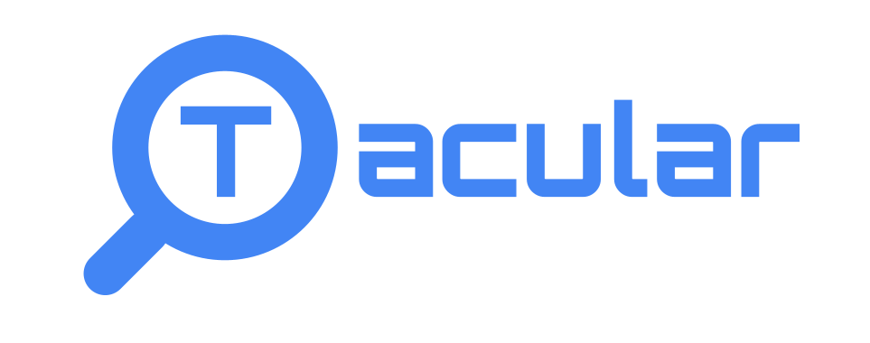

|

.. raw:: html

   

      
      
      
      
      
      
      
   

|

tacular is a lookup library for the reference data every mass spectrometry and
proteomics tool needs: amino acids, elements and isotopes, fragment ion types,
neutral losses, proteases, mzPAF reference molecules, and six post-translational
modification ontologies (UNIMOD, PSI-MOD, RESID, XLMOD, GNOme and UniProt-PTM).
Everything is queried through the same ``LOOKUP[key]`` interface, the data ships
with the package, and there are no runtime dependencies.

Features
--------

* **Modifications**: UNIMOD, PSI-MOD, RESID, XLMOD, GNOme and UniProt-PTM, queryable by id, name, or approximate mass
* **Amino acids**: standard and non-standard amino acids with masses and compositions
* **Elements**: element and isotope masses and abundances
* **Fragment ions**: peptide fragment ion types and their formulas
* **Neutral deltas**: common neutral losses and gains
* **Reference molecules**: mzPAF reference molecules (reporter ions and others)
* **Proteases**: cleavage rules for common proteases
* **Refreshable**: the ``tacular update`` CLI pulls the latest ontology releases into a per-user cache (see :doc:`cli`)

Quick example
-------------

.. code-block:: python

   import tacular as t

   alanine = t.AA_LOOKUP["A"]
   print(alanine.monoisotopic_mass)  # 71.0371137851

   carbon_13 = t.ELEMENT_LOOKUP["13C"]
   print(carbon_13.mass)  # 13.00335483507

   # Identify a modification from an observed mass shift
   hits = t.UNIMOD_LOOKUP.query_mass(79.9663, tolerance=0.001)
   print(hits[0].name)  # Phospho

Related packages
----------------

tacular is the shared data layer of the tacular-omics packages:

* `peptacular <https://peptacular.readthedocs.io/>`_ parses and analyzes ProForma peptide sequences
  (mass, m/z, fragments, isotopes, digestion).
* `paftacular <https://paftacular.readthedocs.io/>`_ parses and serializes mzPAF peak annotations.

.. toctree::
   :maxdepth: 2
   :caption: Contents:

   installation
   quickstart
   cli
   migration
   api/index
   changelog
   citation

Indices and tables
==================

* :ref:`genindex`
* :ref:`modindex`
* :ref:`search`
